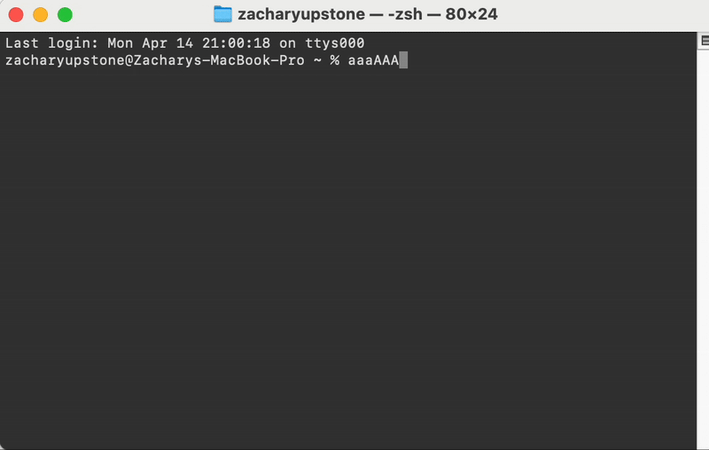

# Flip caps 

Script that allows you to flip the case of the input buffer via `CTRL + t` in terminal

Works with `zsh` live and `bash` (4.0+) retroactively.



`"aaAA" -> "AAaa"`  
`"AAaa" -> "aaAA"`

## Install

Download the [flip-caps-installer](https://github.com/zu213/flip-caps/flip-caps-installer.sh).

Convert it to an executable `chmod +x ./flip-caps-installer`

And run it ! `./flip-caps-installer`

## Manual Install

### zsh

Copy the follow script into `~/.zshrc`

```
function flip_case() {
    BUFFER=$(echo "$BUFFER" | tr 'a-zA-Z' 'A-Za-z')
    zle reset-prompt
}
zle -N flip_case
bindkey '^T' flip_case
```

### bash (4.0+)

Copy the follow script into `~/.bashrc`

```
flip_case() {
    TMPFILE=$(mktemp)
    fc -ln 0 > "$TMPFILE" # Get last command

    tr 'A-Za-z' 'a-zA-Z' < "$TMPFILE" > "$TMPFILE.flipped"
    mv "$TMPFILE.flipped" "$TMPFILE"

    FLIPPED_COMMAND=$(<"$TMPFILE")
    # Remove any leading/trailing whitespace just in case
    FLIPPED_COMMAND="${FLIPPED_COMMAND#"${FLIPPED_COMMAND%%[![:space:]]*}"}"
    FLIPPED_COMMAND="${FLIPPED_COMMAND%"${FLIPPED_COMMAND##*[![:space:]]}"}"

    READLINE_LINE="$FLIPPED_COMMAND"
    READLINE_POINT=${#READLINE_LINE}

    rm "$TMPFILE"
}
bind -x '"\C-t":flip_case'
```